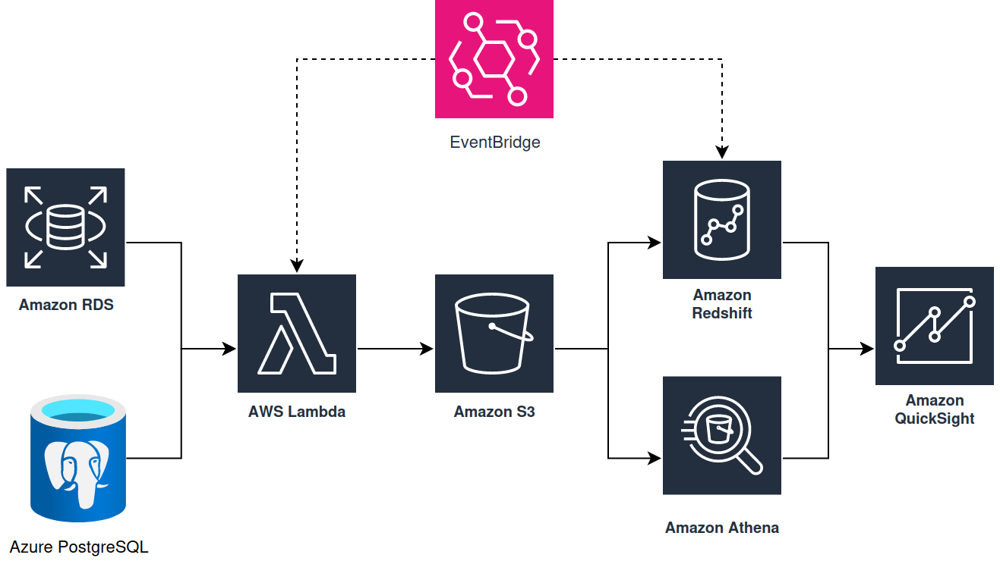

# terraform-lambda-s3
> This is a Terraform code application used to study Infrastructure as Code (IaC).

This work is part of a project for my master's degree, in the subject "advanced topics in IT infrastructure 2 (DevOps)".

After carrying out theoretical research on IaC, to perform practical tests, I developed what could be a small part of a data engineering pipeline.

Here we have a Python application code that scrapes data from global GDP, and saves this data in an S3 bucket. The code is stored in a separate bucket, executed via Lambda function and scheduled by EventBridge. All infrastructure is from AWS.

The objective was to show the development of the infrastructure as code in a data engineering context.

## Installation

To correctly zip the Python dependencies, you must use a Python virtual environment named "venv" to install all packages with pip.

Create the dependencies directory, and install all the requirements:

```sh
sudo apt-get install -y python3-venv
python3 -m venv venv
source venv/bin/activate
pip install -r requirements.txt
deactivate
```

After that, you can run the "zip_code.sh" bash script. This will create a .zip file named "deploy_package.zip". This pack will be uploaded to a S3 bucket, and be executed by a Lambda Function, after the Terraform apply.

On the code root folder (where main_app.py is located):

```sh
bash zip_code.zip
```

## Usage example

The terraform commands will create the services: Lambda Functions, 2 storage buckets, 1 EventBridge invoker and all the permissions between the services.


```sh
terraform init
terraform apply
```

## Development setup

This runs the infrastructure for the middle part of the given data engineering architecture. That's the data processing stage, where we call the Extract, Transform and Load (ETL) pipeline.



## TODO

Upload the variables.tf template file without secret variables.

## Meta

Vitor Lindbergh – [https://github.com/vtrlindbergh](https://github.com/vtrlindbergh)
